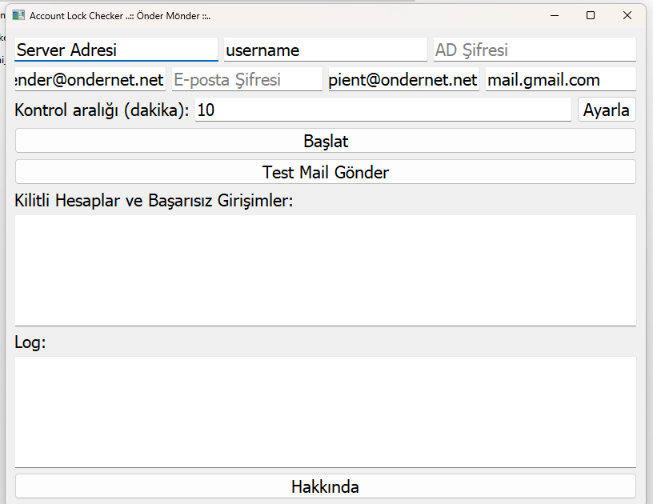

# AD Lock Monitor


<div align="center">



*Active Directory Hesap Kilitleri İzleme Uygulaması*

</div>

## 📋 Genel Bakış
Bu uygulama, Active Directory'deki kilitli hesapları ve başarısız oturum açma girişimlerini gerçek zamanlı olarak izleyen, PyQt5 tabanlı bir masaüstü uygulamasıdır.

## ✨ Özellikler
- ✅ Kilitli hesapları gerçek zamanlı izleme
- ✅ Başarısız oturum açma girişimlerini takip
- ✅ E-posta bildirimleri
- ✅ Detaylı raporlama
- ✅ Kullanıcı dostu arayüz
- ✅ Otomatik yenileme
- ✅ Olay günlüğü kaydı

## ⚠️ Önkoşullar

> [!IMPORTANT]
> ### Sistem Gereksinimleri
> - Windows Server 2012 R2 veya üzeri
> - Python 3.8+
> - Active Directory Domain Services
> - SMTP sunucu erişimi
> 
> ### Yetkiler
> - Domain Admin veya gerekli AD yetkileri
> - Event Log okuma izinleri
> - SMTP gönderim yetkileri

## 🚀 Kurulum Adımları

### 1️⃣ Python Paketlerinin Kurulumu
```bash
pip install -r requirements.txt
```

### 2️⃣ Yapılandırma
`config.ini` dosyasını düzenleyin:
```ini
[ActiveDirectory]
server = your.domain.com
domain = DOMAIN
username = admin
password = ****

[SMTP]
server = smtp.your-company.com
port = 587
username = sender@your-company.com
password = ****
use_tls = True

[Monitoring]
check_interval = 300
alert_threshold = 3
notification_emails = admin@your-company.com,security@your-company.com
```

### 3️⃣ İlk Çalıştırma
> [!WARNING]
> Uygulamayı mutlaka **yönetici** olarak çalıştırın!

## 📖 Kullanım Kılavuzu

### 1️⃣ Ana Ekran Özellikleri

- Kilitli hesaplar listesi
- Başarısız giriş denemeleri
- Anlık istatistikler
- Durum göstergeleri

### 2️⃣ Bildirim Ayarları
- E-posta bildirimleri
- Masaüstü bildirimleri
- Sesli uyarılar
- Özel bildirim kuralları

### 3️⃣ Raporlama
- Günlük/Haftalık/Aylık raporlar
- CSV/PDF export
- Detaylı olay günlüğü
- Trend analizi

## ⚙️ Yapılandırma Detayları

### Active Directory Ayarları
```ini
[ActiveDirectory]
# Domain Controller bilgileri
server = dc01.domain.local
domain = DOMAIN.LOCAL

# Servis hesabı bilgileri
username = service_account
password = ****
```

### SMTP Ayarları
```ini
[SMTP]
# Mail sunucu bilgileri
server = smtp.domain.local
port = 587
username = notifications@domain.local
password = ****
```

## 🛡️ Güvenlik Önerileri

> [!IMPORTANT]
> 1. Servis hesabı için güçlü parola kullanın
> 2. SMTP bağlantılarında TLS kullanın
> 3. Yapılandırma dosyalarını şifreleyin
> 4. Log dosyalarını güvenli konumda saklayın
> 5. Düzenli güvenlik güncellemeleri yapın

## 🔍 Sorun Giderme

### Sık Karşılaşılan Hatalar
1. 🔴 "Access Denied"
   - Yönetici olarak çalıştırın
   - AD yetkilerini kontrol edin

2. 🔴 "SMTP Connection Failed"
   - Firewall ayarlarını kontrol edin
   - SMTP kimlik bilgilerini doğrulayın

3. 🔴 "Event Log Access Error"
   - Event Log servisini kontrol edin
   - Gerekli izinleri kontrol edin

## 📝 Sürüm Geçmişi

### v1.0.0 (2024-02-16)
- ✨ İlk sürüm
- ✨ Temel izleme özellikleri
- ✨ E-posta bildirimleri
- ✨ Raporlama sistemi

## 📱 İletişim ve Destek
- 📧 E-posta: [onder7@gmail.com]
- 🌐 GitHub: [github.com/onder7]
- 📞 Destek: [+90 xxx xxx xx xx]

## ⚖️ Lisans
Bu proje MIT lisansı altında lisanslanmıştır.

## 🤝 Katkıda Bulunma
1. Fork edin
2. Feature branch oluşturun
3. Değişikliklerinizi commit edin
4. Branch'inizi push edin
5. Pull Request oluşturun

## 📓 Geliştirici Notları
- Python 3.8+ gereklidir
- PyQt5 arayüz kütüphanesi kullanılmıştır
- LDAP3 ile AD bağlantısı sağlanmıştır
- Multi-threading ile performans optimizasyonu yapılmıştır

---

<div align="center">

**..:: Onder Monder ::..**

*Profesyonel IT Çözümleri*

</div>
